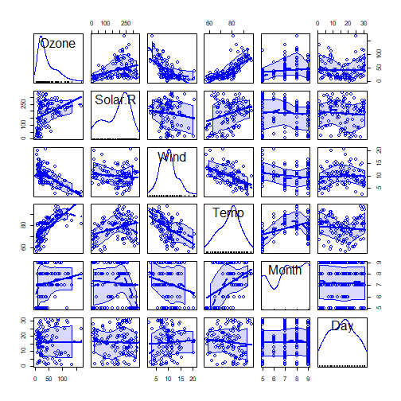
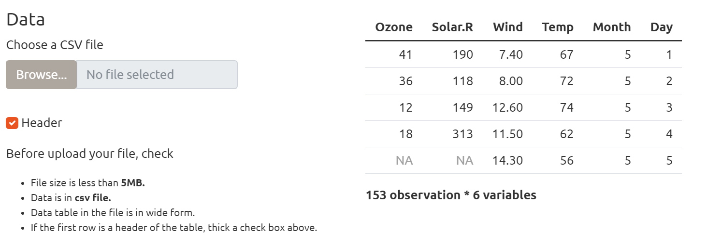
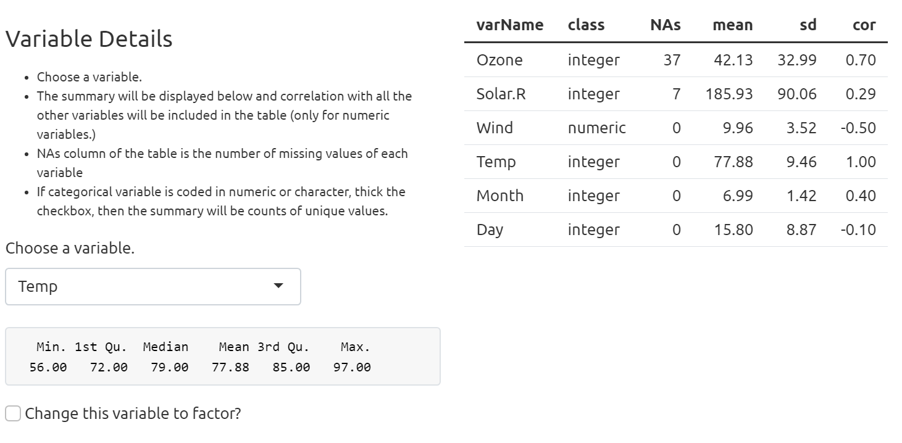
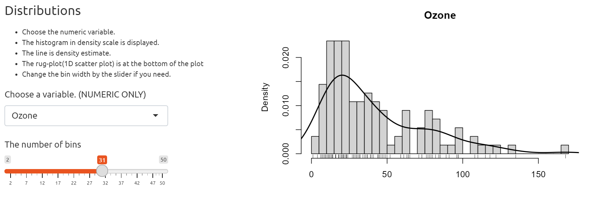
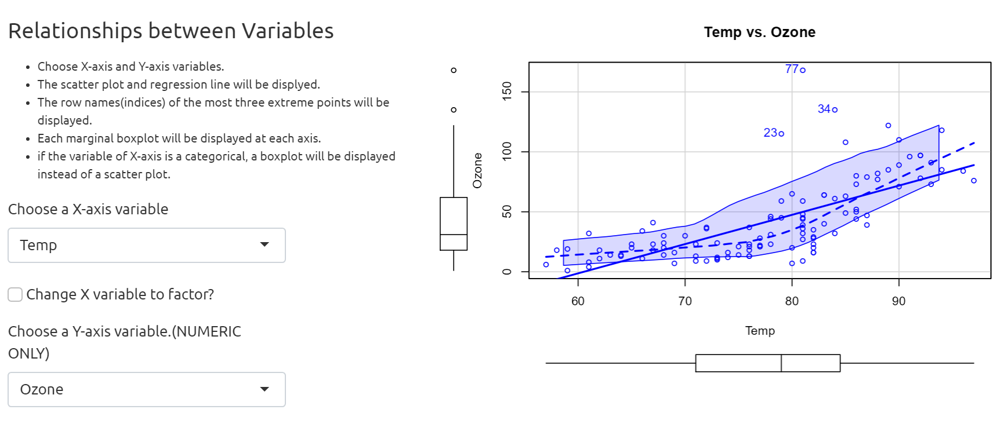

Quick Data Summary Shiny Application
========================================================
author: Ayako Nagao
date: 06 JAN 2023
transition: linear
font-family: 'Helvetica'


Introduction
========================================================
type: sub-section
This Shiny app makes the first exploratory analysis easy and quick.  
As a first exploratory analysis we routinely check its dimension, classes, statistics, missing values, correlations and so on. There are packages that enable us to see the summaries at once or display a matrix of graphs, but sometimes it's difficult to find information we need at a glance. By using this app, you can explore your data in one page, graph the data with different variables without executing the same code multiple times.

This is what we do normally...
========================================================


```
     Ozone           Solar.R           Wind             Temp      
 Min.   :  1.00   Min.   :  7.0   Min.   : 1.700   Min.   :56.00  
 1st Qu.: 18.00   1st Qu.:115.8   1st Qu.: 7.400   1st Qu.:72.00  
 Median : 31.50   Median :205.0   Median : 9.700   Median :79.00  
 Mean   : 42.13   Mean   :185.9   Mean   : 9.958   Mean   :77.88  
 3rd Qu.: 63.25   3rd Qu.:258.8   3rd Qu.:11.500   3rd Qu.:85.00  
 Max.   :168.00   Max.   :334.0   Max.   :20.700   Max.   :97.00  
 NA's   :37       NA's   :7                                       
     Month            Day      
 Min.   :5.000   Min.   : 1.0  
 1st Qu.:6.000   1st Qu.: 8.0  
 Median :7.000   Median :16.0  
 Mean   :6.993   Mean   :15.8  
 3rd Qu.:8.000   3rd Qu.:23.0  
 Max.   :9.000   Max.   :31.0  
                               
```
***



```
'data.frame':	153 obs. of  6 variables:
 $ Ozone  : int  41 36 12 18 NA 28 23 19 8 NA ...
 $ Solar.R: int  190 118 149 313 NA NA 299 99 19 194 ...
 $ Wind   : num  7.4 8 12.6 11.5 14.3 14.9 8.6 13.8 20.1 8.6 ...
 $ Temp   : int  67 72 74 62 56 66 65 59 61 69 ...
 $ Month  : int  5 5 5 5 5 5 5 5 5 5 ...
 $ Day    : int  1 2 3 4 5 6 7 8 9 10 ...
```

Using Shiny App...
========================================================
left: 65%




***

Whenever you upload the csv file, the first 5 rows of the data and dimension of the data will be displayed.

By choosing a variable, its summary and details of all the other variable will be displayed.

========================================================
title: false
left: 65%



URL:
 <https://belanello.shinyapps.io/QuickDataSummary/>
<small> please explore the functionalities with a default dataset first per instructions and then upload your csv file!</small>

***

By choosing numeric variable, histogram (in density scale) will be displayed.


By choosing x-axis and y-axis variable, scatter plot (if x-axis is factor, then boxplot) will be displayed.


